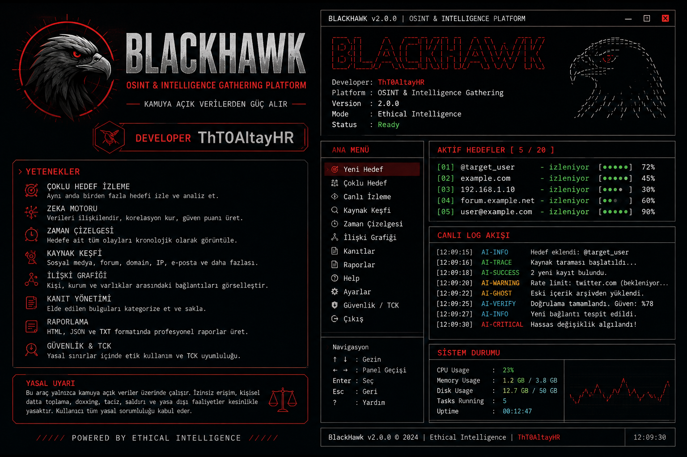

# BLACKHAWK

## Kamu Kaynaklı İstihbarat ve İzleme Terminali

BlackHawk, yalnızca yetkili ve kamuya açık kaynaklardan elde edilen gözlemleri
toplayan, kaynakları ilişkilendiren ve Türkçe raporlayan yerel bir terminal
platformudur. Özel hesaplara erişmez, parola veya token toplamaz, güvenlik
aşmaz, doxxing/taciz amacıyla kullanılmaz ve kaynaksız iddia üretmez.



### Öne çıkanlar

- Görseldeki siyah-kırmızı terminal karakterini taşıyan Türkçe TUI
- Tekli ve çoklu yetkili hedef oturumları
- Demo/offline mod ve güvenli kamu URL'si doğrulaması
- Kaynaklı olaylar, audit log, rate limit ve gizli veri maskeleme
- Alias/URL/zaman korelasyonu ve güven sınıfları
- 1 dakika–300 saat ve özel izleme süreleri
- Etkileşimli görünüme uygun profesyonel koyu HTML raporları
- JSON/TXT dışa aktarma, kanıt özeti, kaynak listesi ve çalışma süresi
- Güvenlik / TCK rehberi ve CVE-ready bildirim şablonu

## Hızlı başlangıç

```bash
pip install blackhawk
blackhawk --demo
```

Yetkili bir kamu URL'si ile:

```bash
blackhawk --target https://example.com --duration 60
```

Üretim öncesinde `blackhawk/README.md`, `blackhawk/SECURITY.md` ve
`blackhawk/CHANGELOG.md` dosyalarını okuyun. Raporlar varsayılan olarak
`reports/` klasörüne yazılır.

## Görsel galeri

| Konu | Görsel |
|---|---|
| Ürün kimliği | [BlackHawk hero](blackhawk/assets/gallery/blackhawk-hero.png) |
| Kamu kaynakları | [Public sources](blackhawk/assets/gallery/blackhawk-public-sources.png) |
| Zaman çizelgesi | [Timeline](blackhawk/assets/gallery/blackhawk-timeline.png) |
| İlişki grafiği | [Network](blackhawk/assets/gallery/blackhawk-network.png) |
| Kanıtlar | [Evidence](blackhawk/assets/gallery/blackhawk-evidence.png) |
| Canlı izleme | [Monitoring](blackhawk/assets/gallery/blackhawk-monitoring.png) |
| Raporlama | [Report](blackhawk/assets/gallery/blackhawk-report.png) |

## Güvenlik ve yasal sınır

BlackHawk yalnızca açıkça yetkilendirilmiş, kamuya açık veri çalışmaları için
tasarlanmıştır. Kaynak şartları, robots.txt, rate limit, telif, kişisel veri
mevzuatı ve yerel hukuk her zaman önceliklidir. Gerçek bir CVE numarası
uydurulmamış veya atanmış gibi gösterilmemiştir.

## Lisans

MIT. Ayrıntılar için [`blackhawk/README.md`](blackhawk/README.md) ve
[`blackhawk/SECURITY.md`](blackhawk/SECURITY.md) dosyalarına bakın.